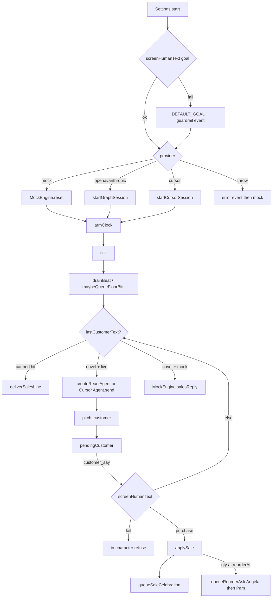

# Agentic System Map

Two agent systems share this repo: the **office** (product-time workers) and the **build** (Cursor agents that wrote the game). This map is the office. Build workflow is in [AI Development Log](AI_DEVELOPMENT_LOG.md).

## 1. Context layers

Context is sliced on purpose. A live model never receives the whole company OS unless it is answering a novel customer line.

| Layer | Where | Who sees it | Lifetime |
| --- | --- | --- | --- |
| Company goal | Settings → `OfficeState.goal` | HUD, blackboard, win check | Session |
| Blackboard | `formatBlackboard` / `formatSlimBoard` | Mock + live sales tick | Session |
| Personal queue | `state.queues[agentId]` | That worker, HUD inspect | Session |
| Short-term memory | last 8 facts per agent | Prompt / recall | Session |
| Long-term memory | `data/memory.json` | `remember` / `recall` tools; keyword score | Across sessions |
| Customer chat log | `state.customerLog` | Salesperson on a live tick (last 4–6 lines) | Session |
| Sales reply cache | in-memory map in `salesScript.ts` | Harness, skips LLM on repeat asks | Process |
| Guardrail rules | `BUSINESS_GUARDRAIL_RULES` + `screenHumanText` | Injected into live prompts; enforced in code | Always |
| Token meter | `todayTokens` on the books | HUD BOOKS; tick gate | Operating day |

`formatSlimBoard` is what the live model actually gets: time, books, current pitch, LOW stock only, last few chat lines. Full warehouse, DMs, and quiet queues were cut after idle ticks burned tokens.

## 2. Agents (roster)

Defined in `src/shared/roster.ts`. Org roles gate tools (`assign_task`, `call_meeting` = CEO/PM; `pitch_customer` / `ring_up` = sales).

| Sprite | Org role | Home zone | Job in the loop |
| --- | --- | --- | --- |
| **Michael** | CEO | `manager_office` | Posts the goal, nags the close, congratulates, yells WHAZUUUP |
| **Angela** | PM | `accounting` | Owns the board and price sheet; walks to Pam on reorder |
| **Jim** | Sales | `bullpen_sales` | Primary customer voice (dry, never pushy); coffee with Pam |
| **Dwight** | Sales | `bullpen_dwight` | Same sale, opposite temperament; recites GSM; puts out fires |
| **Pam** | HR / front desk | `reception` (stand-slot left of the counter) | Seats the customer, logs, rings the $100 bell, mill truck, fax run |

A sixth logical actor is the **Supervisor**, which is **not a sprite**. In v1 it was planned as LangGraph `createSupervisor`. In the shipping loop it is the **harness tick**: schedule + beats + (optional) one sales agent. Michael is the character who announces; the session is the router.

The **human** is two channels:

- **Customer** (`customer_say`) — lobby chat, Jim or Dwight only
- **HQ** (`human_reply`) — balloon answers when someone `ask_human`s

## 3. Tools

All workers share the LangChain tool list in `src/harness/tools.ts`. Cursor wraps the same functions as custom SDK tools, namespaced `jim_pitch_customer` / `dwight_pitch_customer`. Live sales ticks currently **filter to `pitch_customer` only** so the model cannot wander into `move_to` or `call_meeting` on a chat turn.

| Tool | Who | Effect |
| --- | --- | --- |
| `say` | all | Floor balloon (≤110 chars), short-term memory |
| `watercooler` | all | Slack-like broadcast + gossip memory |
| `dm` | all | Private mailbox + whisper balloon |
| `ask_human` | all | HQ balloon; session waits |
| `pitch_customer` | Jim, Dwight | Customer chat line; wait; do not invent the reply |
| `ring_up` | Jim, Dwight | Decrement SKU, credit cash, maybe reorder + celebration |
| `assign_task` | Michael, Angela | Ticket on board + owner queue |
| `update_task` | all | Status/note on a ticket |
| `call_meeting` | Michael, Angela | Pause queues, pull attendees to conference |
| `meeting_speak` | attendees | One line; last turn ends the meeting |
| `remember` / `recall` | all | File-backed long-term memory |
| `move_to` | all | Zone walk; sales/Pam constrained to desks/reception |

Every spoken tool runs `screenToolText` first (no commands, no dumps).

## 4. Workstreams

Independent streams that share `OfficeState` but do not all need an LLM:

```
                    ┌──────────── session.tick() ────────────┐
                    │ busy lock; +1 sim minute               │
                    │                                        │
   ┌────────────────┼──────────────┬─────────────┬───────────┤
   ▼                ▼              ▼             ▼           ▼
 schedule        wanderers      floor beats   sales LLM    mock
 login/standup   recall Jim/    fire, fax,    novel chat   scripted
 lunch/wrap      Dwight/Pam     coffee,       reply only   MORNING/
                 to desks       reorder,                    IDLE
                                Whazup,
                                mill truck
```

| Workstream | Trigger | LLM? | Files |
| --- | --- | --- | --- |
| **Office clock** | interval `SPEED_MS` | no | `session.ts`, `clock.ts` |
| **Day schedule** | clock hits 09:00 / 10:00 / 12:00 / 17:00 | no | `environment.ts` |
| **Floor beats** | tick, if no meeting and queue empty enough | no | `beats.ts` |
| **Sales conversation** | `lastCustomerText` set after a screened customer line | yes, unless canned cache hits | `salesScript.ts`, `graph.ts`, `cursorEngine.ts` |
| **Commerce** | purchase intent or `ring_up` | no | `commerce.ts`, `officeState.applySale` |
| **Guardrails** | every `customer_say`, `human_reply`, `start.goal` | no | `guardrails.ts` |
| **Memory persist** | `remember` / mock gossip | no | `memory.ts` |
| **Render** | WebSocket events | no | `OfficeScene.ts` |

Priority inside a tick (early return):

1. If `pendingHuman` → wait (HQ balloon open)
2. Drain one **beat** if queued (keeps fire/fax/coffee atomic)
3. If token cap spent → no new LLM work
4. Mock engine **or** due schedule / scripted standup / live sales tick

## 5. Orchestration



**Live OpenAI/Anthropic:** one `createReactAgent` per needed reply, named as Jim or Dwight, tools filtered to `pitch_customer`, prompt = persona + slim board + guardrail rules. Thread id is unique per tick (`sales-${tick}-${Date.now()}`) so history does not stack.

**Live Cursor:** `Agent.create` in a temp sandbox, `disallowedTools` includes shell/read/edit/grep/web/delete/semSearch/…. Custom tools only. `run.wait()`, record billed tokens (or a char/4 estimate). Agent is disposed after the turn.

**Mock:** `MORNING` (cooler → straw → pitch), then idle floor chatter while waiting on the customer, then `AFTERNOON` board updates. Purchase uses the same `applySale` path as live.

## 6. Coordination toward the goal

On session start the supervisor-as-harness writes a five-ticket board (`AO-1`…`AO-5`): name the sale, price the deal, close the lobby, seat/log, backup close.

Win is **not** “all tickets done.” It is `goalReached(goal, todayEarnings)` after a real ring-up, then a `review` beat that emits `goal_met` (the QUARTERLY REVIEW stamp) once Michael’s congratulations have played.

Agents do not share a hidden transcript. They share the blackboard, mailboxes, and the watercooler — the same objects the HUD shows.
